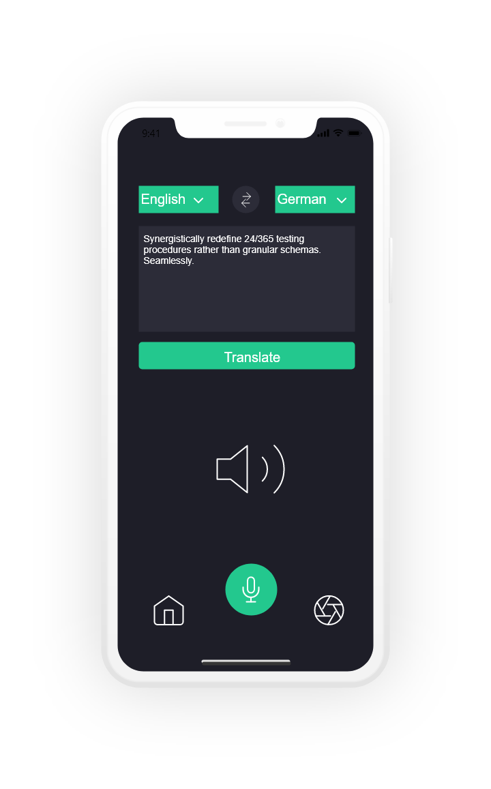

# Understand

## Introduction

> Understand is a simple translator app that outputs translations as speech, making it perfect for travelers.
Currently the project only synthesizes user input, but later iterations will translate text-to-speech, speech-to-speech, and from an image.
The project does contain the translation code, however it does not yet work.

## Code Samples

> To set up the Microsoft Azure Speech Synthesizer

    var synthesizer = new SpeechSynthesizer(config);
    using (var result1 = await synthesizer.SpeakTextAsync(text))

## Installation

> Open the source code in your preferred IDE and build it to your device. Open the app, choose the languages from the drop downs, input your sentence and click on translate.
